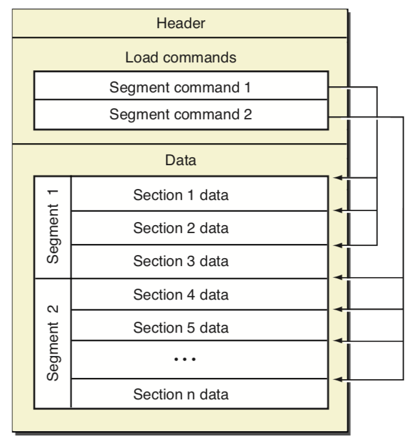

# Mach-O 的结构



Mach-O 按结构可分为三部分：**Header**、**Load Commads**、**Data**

## Header

```
/*
 * The 64-bit mach header appears at the very beginning of object files for
 * 64-bit architectures.
 */
struct mach_header_64 {
	uint32_t	magic;		/* mach magic number identifier */
	cpu_type_t	cputype;	/* cpu specifier */
	cpu_subtype_t	cpusubtype;	/* machine specifier */
	uint32_t	filetype;	/* type of file */
	uint32_t	ncmds;		/* number of load commands */
	uint32_t	sizeofcmds;	/* the size of all the load commands */
	uint32_t	flags;		/* flags */
	uint32_t	reserved;	/* reserved */
};
```

Header 包含基础信息：架构、cpu类型、Mach-O类型、command数量大小

filetype：

```
#define	MH_OBJECT	0x1		/* relocatable object file */
#define	MH_EXECUTE	0x2		/* demand paged executable file */
#define	MH_FVMLIB	0x3		/* fixed VM shared library file */
#define	MH_CORE		0x4		/* core file */
#define	MH_PRELOAD	0x5		/* preloaded executable file */
#define	MH_DYLIB	0x6		/* dynamically bound shared library */
#define	MH_DYLINKER	0x7		/* dynamic link editor */
#define	MH_BUNDLE	0x8		/* dynamically bound bundle file */
#define	MH_DYLIB_STUB	0x9		/* shared library stub for static */
					/*  linking only, no section contents */
#define	MH_DSYM		0xa		/* companion file with only debug */
					/*  sections */
#define	MH_KEXT_BUNDLE	0xb		/* x86_64 kexts */
#define	MH_FILESET	0xc		/* set of mach-o's */
```


## Load Commands

**Header**后面是**Load Commands**列表，描述**Data**的结构分布。部分command还包含一定数量的**setion**，是对一小段**Data**更详尽的描述。

所有command都有两个固定字段：cmd（类型）、cmdsize（大小）

```
struct load_command {
	uint32_t cmd;		/* type of load command */
	uint32_t cmdsize;	/* total size of command in bytes */
};
```


前四个command，类型都是`LC_SEGMENT_64`: 

**LC_SEGMENT_64(__PAGEZERO)**

**LC_SEGMENT_64(__TEXT)**

**LC_SEGMENT_64(__DATA)**

**LC_SEGMENT_64(__LINKEDIT)** 

```
struct segment_command_64 { /* for 64-bit architectures */
	uint32_t	cmd;		/* LC_SEGMENT_64 */
	uint32_t	cmdsize;	/* includes sizeof section_64 structs */
	char		segname[16];	/* segment name */
	uint64_t	vmaddr;		/* memory address of this segment */
	uint64_t	vmsize;		/* memory size of this segment */
	uint64_t	fileoff;	/* file offset of this segment */
	uint64_t	filesize;	/* amount to map from the file */
	vm_prot_t	maxprot;	/* maximum VM protection */
	vm_prot_t	initprot;	/* initial VM protection */
	uint32_t	nsects;		/* number of sections in segment */
	uint32_t	flags;		/* flags */
};
```

segment_command_64 包含信息：段名、文件偏移、文件大小、虚拟地址、虚拟内存大小、section数量 ...

程序加载后	虚拟地址 = vmaddr + slide


**LC_SEGMENT_64(__TEXT)**、**LC_SEGMENT_64(__DATA) **包含了多个section

```
struct section_64 { /* for 64-bit architectures */
	char		sectname[16];	/* name of this section */
	char		segname[16];	/* segment this section goes in */
	uint64_t	addr;		/* memory address of this section */
	uint64_t	size;		/* size in bytes of this section */
	uint32_t	offset;		/* file offset of this section */
	uint32_t	align;		/* section alignment (power of 2) */
	uint32_t	reloff;		/* file offset of relocation entries */
	uint32_t	nreloc;		/* number of relocation entries */
	uint32_t	flags;		/* flags (section type and attributes)*/
	uint32_t	reserved1;	/* reserved (for offset or index) */
	uint32_t	reserved2;	/* reserved (for count or sizeof) */
	uint32_t	reserved3;	/* reserved */
};
```

section_64 包含信息：所属段名、节名、相对段偏移...


## Data

**Data**是除去Header头部信息和command描述信息后的部分，也是真正存储代码、数据、符号等内容的区域。


## ## Mach-O 结构图

除了按照**Header**、**Load Commads**、**Data**结构划分以外，依据**Load Commads**描述的segment，Mach-O又可以划分为以下结构：


图中三个segment：

- **__TEXT**  (图 segment 1，包含Header、Load Commads、Data中的代码区域)
- **__DATA**  (图 segment 2）
- **__LINKEDIT**   (图 segment 3）


# TODO

简单记录Mach-O结构，后续再补充


# 参考

[Mach-O 简单分析](https://zhangbuhuai.com/post/macho-structure.html)

